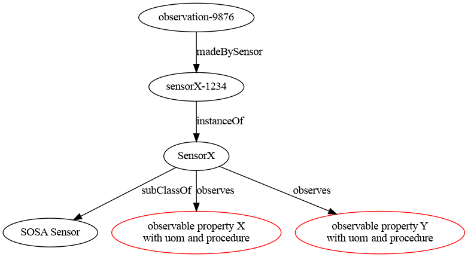
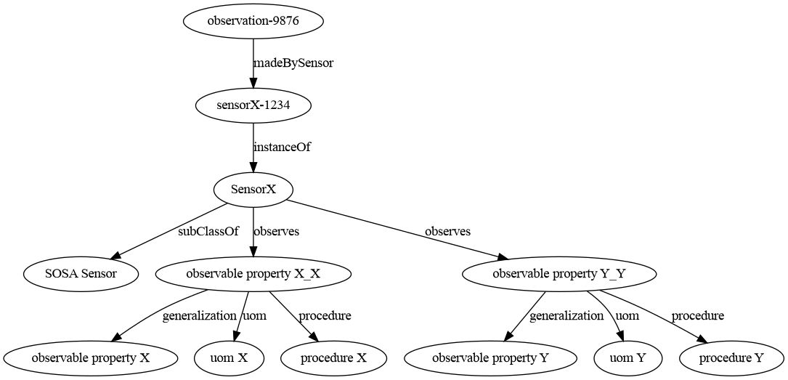

# Complex sensors

This section contains an example for defining complex sensors that can observe more than one property, each of which
is described by including its resulting unit of measure and procedure (and, potentially, other information).

The goal is to create sensor classes that can act as "datasheets" so that consumers can later look up the
metadata for a given sensor class and infer metadata on observations or observation collections.

Complex sensors can be understood as one of the two following ways:

1. Each sensor is actually a platform composed of different sensors, each of which observes a single property.
2. Each sensor observes qualified properties, which are specializations of generic observable properties with
  specific metadata.

In this section, we describe the sensors using the second approach. 

[This document](https://docs.google.com/document/d/1fzEKymhmAB4dVEEgJE3XXf4DTzPS60oj3wYzJQrZcrE/)
includes a more detailed discussion of the modeling decisions for this scenario.

## Modeling procedures

Procedures in this section are modeled as a series of steps. Given the difficulty of working with 
RDF collections, qualifications are introduced by using a blank node with:

* a SKOS `skos:broader` relationship to the general procedure.
* an RDF Data Cube `qb:order` value for sorting. 