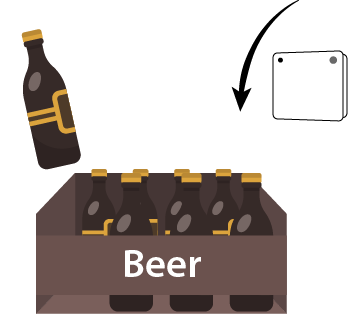
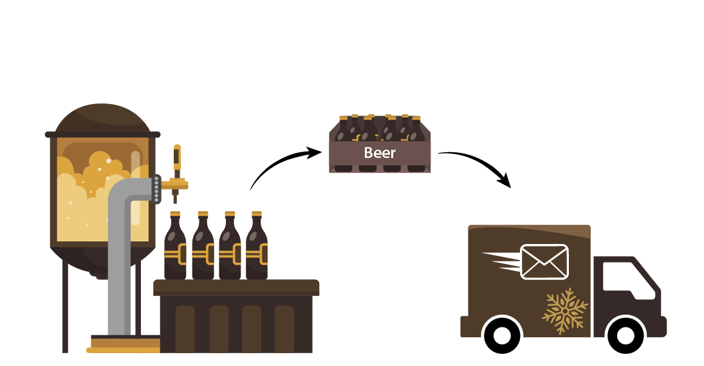
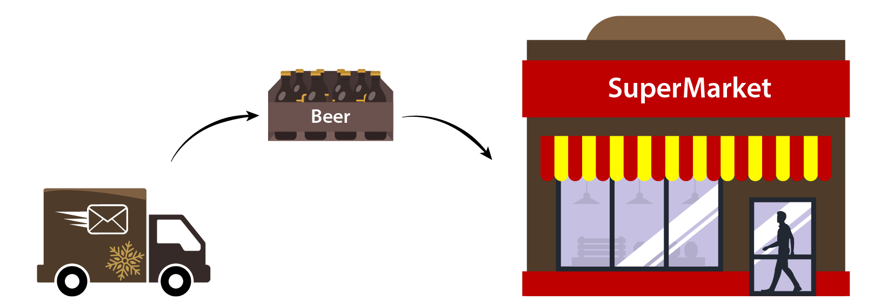

# Tracking Beer Temperature with IBS-TH2 Sensor

This is a detailed example where a IBS-TH2 sensor is used to monitor a crate
(carton) of beer from the time of its packaging at a brewery until its
display in a supermarket cooler where it is purchased.

Beer spoils at both high and low temperatures which requires it to be kept
cool during storage and shipping.  Humidity has no effect on beer within a
sealed container, excess humidity will weaken cardboard and degrade the
adhesives, potentially resulting in product breakage.  Brewers will
therefore insert a temperature logger into their shipments for occasional
quality control.  We present such a hypothetical situation here as an
example.

# Table of Contents

* [A short note about sensors as commercial products](#a-short-note-about-sensors-as-commercial-products)
* [Packaging and initial storage](#packaging-and-initial-storage)
* [Shipping to Retail Store](#shipping-to-retail-store)
* [Display in Retail Store Cooler](#display-in-retail-store-cooler)
* [Notes on deployment and observation aggregation](#notes-on-deployment-and-observation-aggregation)
* [Recording data and sensor tasking through sensorvdeployments](#recording-data-and-sensor-tasking-through-sensor-deployments)
* [Recording data using observation collection](#recording-data-using-observation-collection)
* [Recording data using sample collection](#recording-data-using-sample-collection)


The example is of interest because it involves the repurposing of a
commodity, a consumer-grade [sosa:Platform](https://www.w3.org/TR/vocab-ssn/#SOSAPlatform) deployed to
address a domain-specific problem, the movement of a platform from
environment to environment and the possible ambiguity of data-ownership in
each of these environments.  It also demonstrates the location ambiguity
that can sometimes be present when modeling sensor readings.

Note: The use of long identifiers is for readability purposes and is non-normative.

### A short note about sensors as commercial products

Sensors are often sourced
commercially and installed
as part of larger
[deployments]((https://www.w3.org/TR/vocab-ssn/#SOSADeployment) or
[platforms](https://www.w3.org/TR/vocab-ssn/#SOSAPlatform). These
standardized offerings need to be communicated in a way that is machine
readable and other vocabularies are available to do so.

From a procurement and product recall approach, vocabulatories are
differentiate between the product class and the specific instance of the
product being consumed.  The ability to align Sosa and product vocabularies
are beneficial in that it permits a unified description of the sensor.  This
include modeling the sensor throughout its lifetime, announcing commercial
availability, procurement, deployment, operation, decomissioning and
disposal.

To this end this example models IBS TH2 sensors using schema.org Product and
[GS1 WebVoc](https://ref.gs1.org/voc/) Product classes.  This permits concurrent support for both Search Engine
Optimization (SOA) and consumer supply chain product identification using
barcodes.

Different design decisions also mean that design desision such as [punning](https://www.w3.org/2007/OWL/wiki/Punning)
are needed to retain compatibility across different vocabularies. 
[Schema.org](https://schema.org/)
distinguishes between the product and its materialization with two
classes: [Product](https://schema.org/Product) and
[IndividualProduct](https://schema.org/IndividualProduct). Documented within
Section 9.6 of 
the [GS1 Digital Link
Standard](https://www.gs1.org/docs/Digital-Link/GS1_Digital_link_Standard_i1.1.1.pdf), 
GS1 deals with this same problem by subclassing its [Product](https://ref.gs1.org/voc/Product)
class for both unique instances or indicating lot membership. Concurrently
supporting both vocabularies obviously requires that a physical instance of
a sensor be both an instance and a class. 

## Packaging and initial storage


Alice works for Acme Brewery Co.  She procures an InkBird IBS-TH2 Platform
(Serial Number: 12345) and places it inside a beer carton with six bottles
(a "six-pack") of Acme Brewery's famous Porter beers with a product lot code
of PO202402.  She seals the package and places it inside of Acme Brewery's
cooler to await shipment.

We model the packaging activity and the placement of the Platform into the
crate before it is sealed.  The platform monitors the ambient air
temperature and the relative humidity within the beer crate every few
minutes.  In the following snippet, we instantiate the IBS-TH2 Platform, the
carton, and the activity that represents the packaging of the beer and the
creation of the beer carton as a product:

The platform then begins to take measurements that are recorded as part of a data logging
activity:

An RDF file containing a [graph corresponding to this example is available in ACME-Beer/Beer-Packaging-IBS-TH2.ttl](./ACME-Beer/Beer-Packaging-IBS-TH2.ttl).

```
@prefix rdf:  <http://www.w3.org/1999/02/22-rdf-syntax-ns#> .
@prefix rdfs: <http://www.w3.org/2000/01/rdf-schema#>.
@prefix xsd:  <http://www.w3.org/2001/XMLSchema#> .
@prefix skos: <http://www.w3.org/2004/02/skos/core#> .
@prefix qudt: <http://qudt.org/schema/qudt/> .
@prefix unit: <http://qudt.org/vocab/unit/> .
@prefix foaf: <http://xmlns.com/foaf/0.1/> .
@prefix schema: <http://schema.org/> .
@prefix gs1: <https://gs1.org/voc/> .
@prefix prov: <http://www.w3.org/ns/prov#> .
@prefix rel: <http://id.loc.gov/vocabulary/relators/> .
@prefix sosa-env: <http://www.w3.org/ns/sosa/system-environment-properties#> .
@prefix dcterms: <http://purl.org/dc/terms/> .
@prefix org: <http://www.w3.org/ns/org#> .
@prefix beer: <https://rdf.ag/o/beer#> .
@prefix owl: <http://www.w3.org/2002/07/owl#> .
@prefix sosa: <http://www.w3.org/ns/sosa/> .
@prefix ex: <http://example.org/> .
@prefix sensor: <https://example.org/sensor/> .
@base <http://example.org/data/> .
#In this scenario a local brewery makes use of the sensor to track the 
#temperature of their beer as it is packaged, stored, shipped and displayed for sale.

<acmeBreweryCo> a org:Organization, beer:Brewery ;
	foaf:name "Acme Brewery Co." .

<acmeBrewerCooler> a ex:Cooler .

<alice> a foaf:Person, prov:Agent ;
	foaf:name "Alice" .

# A "six pack" as packaged and sold by Acme Brewery Co.

<acmePorterSixPack> a beer:Porter, gs1:Product, schema:Product ;
    skos:definition "A six pack of Acme Porter."@en .

# A specific (instance) six pack of Acme Porter Beers
# We use GS1-style lot and serial numbers as part of the 
# identifier to highlight that this is a physical instance of the product.
 
<10/PO202402/21/0001/acmePorterSixPack> a schema:IndividualProduct;
    rdfs:subClassOf <acmePorterSixPack>;
    gs1:packaging <0001/ProductPackaging>;
    gs1:hasBatchLotNumber "PO202402" ;
    gs1:hasSerialNumber "0001" .

<0001/ProductPackaging> a gs1:PackagingDetails, sosa:FeatureOfInterest ;  
    rdfs:label "An instance of a beer carton used to package a six pack."@en .

# Alice packages the Beer.

<12345/someTH2> a sensor:IBS-TH2-Plus, schema:IndividualProduct ;
    rel:own <acmeBreweryCo> ; # Sensor may be returned.
    rdfs:label "InkBird Sensor that Alice bought to track beer storage."@en ;
    sosa:hasSubSystem <12345/HumiditySensor>, <12345/TemperatureSensor> ;
    gs1:hasSerialNumber "12345" ;
    ex:deviceAddress "12:34:56:12:34:56" .

<00001/packingSixPack> a prov:Activity ;
    rdfs:comment "When Alice packaged Porter bottles into the box, she added an InkBird logger to check that the beer wasn't getting too warm in transit and storage." ;    
    prov:wasAssociatedWith <alice> ;
    prov:used <12345/someTH2> ;
    prov:used <0001/ProductPackaging> ;
    prov:startedAtTime "2024-02-20T01:35:00Z"^^xsd:dateTime;
    prov:endedAtTime   "2024-02-20T01:40:00Z"^^xsd:dateTime;   
    prov:atLocation <acmeBreweryCo> ;
    prov:generated <10/PO202402/21/0001/acmePorterSixPack> .

# These definitions look redundant; but they represent the specific, physical instantiation of the sensors.

<12345/HumiditySensor> a sensor:IBS-TH2-Plus-H ;
    rdf:comment "This is the instance of the humidity sensor instance."@en .

<12345/TemperatureSensor> a sensor:IBS-TH2-Plus-T ;
    rdf:comment "This is the instance of the temperature sensor instance."@en .
#
# Sensor activates and records temperature while in the brewery cooler.
    
<1a/observation> a sosa:Observation ;
    rel:own <acmeBreweryCo> ;
    sosa:observedProperty sosa-env:AmbientTemperature ;
    sosa:hasUltimateFeatureOfInterest <10/PO202402/21/0001/acmePorterSixPackBeerSample> ; 
    sosa:madeBySensor <12345/TemperatureSensor>  ;
    sosa:hasFeatureOfInterest <10/PO202402/21/0001/acmePorterSixPackAirSample> ;
    sosa:resultTime "2024-02-20T01:35:45Z"^^xsd:dateTime ;
    sosa:hasResult [
      a qudt:QuantityValue ;
      qudt:hasUnit unit:DEG_C ;
      qudt:value 12.0 ;
    ] ;
.
<1b/observation> rdf:type sosa:Observation ;
    rel:own <acmeBreweryCo> ;
    sosa:observedProperty sosa-env:AmbientHumidity;
    sosa:hasUltimateFeatureOfInterest <0001/ProductPackaging>;
    sosa:madeBySensor <12345/HumiditySensor>  ;
    sosa:hasFeatureOfInterest <10/PO202402/21/0001/acmePorterSixPackAirSample> ;
    sosa:resultTime "2024-02-20T01:35:45Z"^^xsd:dateTime ;
    sosa:hasResult [
      a qudt:QuantityValue ;
      qudt:hasUnit unit:PERCENT ;
      qudt:value 60 ;
    ] ;
.
<breweryObserver> a prov:Activity ;
    rdfs:comment "Brewery operating system logging process." ;
    prov:atLocation <acmeBreweryCo> ;
    prov:generated <1a/observation> ;
    prov:generated <1b/observation> ;
    prov:wasStartedBy <alice> . # She turned it on last time.     
```

In the example above, concurrent use of the 
[sosa:hasFeatureOfInterest](https://www.w3.org/TR/vocab-ssn/#SOSAhasFeatureOfInterest) 
and [sosa:hasUltimateFeatureOfInterest](https://www.w3.org/TR/vocab-ssn/#SOSAhasUltimateFeatureOfInterest) 
properties is made to account for the repurposing of a generic sensor.  The
actual measurement performed by the platform is the air temperature within
the carton, as a proxy for the beer temperature within each beer vessel. 
Modeling the full thermodynamic activity relating one measurement to the
other is beyond the scope of this document, but could be implemented as a
second order "virtual" [sosa:Sensor](https://www.w3.org/TR/vocab-ssn/#SOSASensor) or a sophisticated [sosa:Procedure](https://www.w3.org/TR/vocab-ssn/#SOSAProcedure).  Thus the use of the [sosa:hasUltimateFeatureOfInterest](https://www.w3.org/TR/vocab-ssn/#SOSAhasUltimateFeatureOfInterest) property allows for flexibility in interpretation of the measurement within a context *not necessarily intended by the original sensor design*.
   
Physically, both <12345/HumiditySensor> and <12345/TemperatureSensor> are monitoring the ambient air within the specific Porter carton which we define as <10/PO202402/21/0001/acmePorterSixPackAirSample> which resolves the issue of the location of the measurement when the carton itself is in motion. The <a href="#SOSAhasUltimateFeatureOfInterest">`sosa:hasUltimateFeatureOfInterest`</a> property targets the beer temperature within that carton and the humidity the cardboard of the carton was subjected to:

An RDF file containing a [graph corresponding to this example is available in ACME-Beer/Beer-FeatureOfInterest-IBS-TH2.ttl](ACME-Beer/Beer-FeatureOfInterest-IBS-TH2.ttl).

```
@prefix rdf:  <http://www.w3.org/1999/02/22-rdf-syntax-ns#> .
@prefix rdfs: <http://www.w3.org/2000/01/rdf-schema#>.
@prefix xsd:  <http://www.w3.org/2001/XMLSchema#> .
@prefix skos: <http://www.w3.org/2004/02/skos/core#> .
@prefix unit: <http://qudt.org/vocab/unit/> .
@prefix qudt: <http://qudt.org/schema/qudt/> .
@prefix sosa-env: <http://www.w3.org/ns/sosa/system-environment-properties#> .
@prefix beer: <https://rdf.ag/o/beer#> .
@prefix sosa: <http://www.w3.org/ns/sosa/> .
@prefix sensor: <https://example.org/sensor/> .
@base <http://example.org/data/> .

# A (virtual) sample of air within the six pack
<10/PO202402/21/0001/acmePorterSixPackAirSample> a sosa:Sample ;
    rdfs:label "Air within the six pack"@en ;
    sosa:isSampleOf <10/PO202402/21/0001/acmePorterSixPack> .

# A (virtual) sample of the beer from the six pack, implicitly assumes that the
# sample is representative of the contents of all bottles. 
<10/PO202402/21/0001/acmePorterSixPackBeerSample> a  sosa:FeatureOfInterest, sosa:Sample, beer:Porter ;
    rdfs:label "A (virtual) sample of beer within the six pack"@en ;
    sosa:isSampleOf <10/PO202402/21/0001/acmePorterSixPack> .

# We define this as the beer temperature, but ontologically it is a 
# generic definition for the temperature of the sample.
<10/PO202402/21/0001/BeerTemperature> a sosa:Property ;
    qudt:hasUnit unit:DEG_C ;
    sosa:isPropertyOf <10/PO202402/21/0001/acmePorterSixPackBeerSample> ;
    rdfs:label "Biertemperatur"@de, "Beer Temperature"@en, "Température de la bière"@fr ;
    skos:definition "Temperature of Beer."@en .

```

The SOSA ontology takes a "feature and property" approach that is referenced
by observations.  The feature of interest &mdash; in this case, the ambient
air within the carton (<10/PO202402/21/0001/acmePorterSixPackAirSample>) is
the feature that the Platform is concerned with.  However, it is really a
proxy for both the temperature of the beer within the individual containers
(<10/PO202402/21/0001/acmePorterSixPackBeerSample>) within the carton and
the relative humidity to which the packaging (<0001/ProductPackaging>) is
being exposed.  The beer "sample" in this case is virtual; the node serves
only to semantically link the observation to the beer liquid itself without
any physical sample being taken.  A more detailed example with physical beer
samples is found in [[[#beerCollections]]].

## Shipping to Retail Store<


After being chilled in the brewery cooler, the beer carton is then loaded on
one of the Acme delivery trucks for shipment to the retail store.  The
truck's cooling management system is recording the sensor readings for both
the shipping company and the brewery.  An on-board GPS unit annotates the
activity of recording observations as the truck moves from location to
location.  This position information represents the location of the shipping
truck itself without reference to the beer carton or the platform generating
the readings.  This is important, in that the underlying properties and
features referenced by the sensors of the platform have not changed, even
through the beer carton and the platform have obviously changed physical
location.

The information recorded during this time period would be:

An RDF file containing a [graph corresponding to this example is available in ACME-Beer/Beer-Shipping-IBS-TH2.ttl](ACME-Beer/Beer-Shipping-IBS-TH2.ttl).

```
@prefix rdf:  <http://www.w3.org/1999/02/22-rdf-syntax-ns#> .
@prefix rdfs: <http://www.w3.org/2000/01/rdf-schema#>.
@prefix xsd:  <http://www.w3.org/2001/XMLSchema#> .
@prefix qudt: <http://qudt.org/schema/qudt/> .
@prefix unit: <http://qudt.org/vocab/unit/> .
@prefix foaf: <http://xmlns.com/foaf/0.1/> .
@prefix prov: <http://www.w3.org/ns/prov#> .
@prefix rel: <http://id.loc.gov/vocabulary/relators/> .
@prefix sosa-env: <http://www.w3.org/ns/sosa/system-environment-properties#> .
@prefix geosparql: <http://www.opengis.net/ont/geosparql#> .
@prefix org: <http://www.w3.org/ns/org#> .
@prefix beer: <https://rdf.ag/o/beer#> .
@prefix sosa: <http://www.w3.org/ns/sosa/> .
@prefix ex: <http://example.org/> .
@prefix sensor: <https://example.org/sensor/> .
@base <http://example.org/data/> .

<acmeBreweryCo> a org:Organization, beer:Brewery ;
	foaf:name "Acme Brewery Co." .

<acmeDelivery> a org:Organization ;
	foaf:name "Acme Delivery Co." .

<acmeTruck> a ex:RefrigeratedTruck .

#
# Product is loaded on the truck
#
<67a/observation> a sosa:Observation, prov:Entity ;
    rel:own <acmeBreweryCo> ;
    rel:own <acmeDelivery> ;
    sosa:observedProperty <10/PO202402/21/0001/BeerTemperature> ;
    sosa:hasUltimateFeatureOfInterest <10/PO202402/21/0001/acmePorterSixPackBeerSample> ;
    sosa:madeBySensor <12345/TemperatureSensor>  ;
    sosa:hasFeatureOfInterest <10/PO202402/21/0001/acmePorterSixPackAirSample> ;
    sosa:resultTime "2024-02-22T04:15:05Z"^^xsd:dateTime ;
    sosa:hasResult  [
      a qudt:QuantityValue ;
      qudt:hasUnit unit:DEG_C ;
      qudt:value 19.0 ;
    ] ;
.
<67b/observation> rdf:type sosa:Observation,prov:Entity ;
    rel:own <acmeBreweryCo> ;
    rel:own <acmeDelivery> ;
    sosa:observedProperty ex:airRelativeHumidity ;
    sosa:hasUltimateFeatureOfInterest <0001/ProductPackaging>;
    sosa:madeBySensor <12345/HumiditySensor>  ;
    sosa:hasFeatureOfInterest <10/PO202402/21/0001/acmePorterSixPackAirSample> ;
    sosa:resultTime "2024-02-22T04:15:05Z"^^xsd:dateTime ;
    sosa:hasResult [
      a qudt:QuantityValue ;
      qudt:hasUnit unit:PERCENT ;
      qudt:value 74 ;
    ] ;
.
<123/TruckObserver> a prov:Activity ;
    rdfs:comment "Truck onboard monitoring system" ;
    prov:used <acmeTruck> ;
    prov:generated <67a/observation> ;
    prov:generated <67b/observation> ;
    prov:startedAtTime "2024-02-22T04:15:05Z"^^xsd:dateTime ;
    prov:endedAtTime "2024-02-22T05:55:38Z"^^xsd:dateTime ;
    prov:wasStartedBy <driver> ;
    prov:atLocation <gpsLocation> .

# This is the output from the truck's GPS receiver. We only get coordinates
# from it.

<gpsLocation> a prov:Location, geosparql:Geometry; 
   geosparql:asWKT "POINT(-79.35553 43.66372)"^^geosparql:wktLiteral .
```
 
The sensors of the platform are reporting values for the same properties of
the same features of interest; the physical location of the carton of beer
does not effect the process because the platform monitors the inside of the
carton itself.  Modeling its location and the process of (un)loading of the
carton from the truck is done through other rdf nodes.  The truck on-board
monitoring system does report a GPS geometry as a Location.  This is the
location at which the data was recorded from the platform.  It is
conceivable that the geometry node is shared with a vehicle tracking system
rdf representation or the vehicle's delivery scheduling application but it
is not mandated by Sosa.

Note: Locations of Platform, Sensors, and measured samples are often
conflated in non-semantically enabled systems and the semantics often
implicitly assumed by the application.  The deep semantic modeling within
Sosa makes no such implicit assumptions and locations can be assigned to all
elements independently.
 
## Display in Retail Store Cooler 



When received from the delivery company by the retail store, the beer is displayed for sale in retail coolers which log the sensors to the data being held by the retail store. We notice again the semantics of location and containment; the sensor is contained within the carton, which is contained within the cooler, which is itself located within the store. However, none of these semantic is recorded. The only location activity is the activity is taking place within the supermarket cooler; not the supermarket itself. 

The information recorded during this time period would be:

An RDF file containing a [graph corresponding to this example is available in ACME-Beer/Beer-Supermarket-IBS-TH2.ttl](ACME-Beer/Beer-Supermarket-IBS-TH2.ttl).

```
@prefix rdf:  <http://www.w3.org/1999/02/22-rdf-syntax-ns#> .
@prefix rdfs: <http://www.w3.org/2000/01/rdf-schema#>.
@prefix xsd:  <http://www.w3.org/2001/XMLSchema#> .
@prefix qudt: <http://qudt.org/schema/qudt/> .
@prefix unit: <http://qudt.org/vocab/unit/> .
@prefix foaf: <http://xmlns.com/foaf/0.1/> .
@prefix prov: <http://www.w3.org/ns/prov#> .
@prefix rel: <http://id.loc.gov/vocabulary/relators/> .
@prefix sosa-env: <http://www.w3.org/ns/sosa/system-environment-properties#> .
@prefix org: <http://www.w3.org/ns/org#> .
@prefix sosa: <http://www.w3.org/ns/sosa/> .
@prefix ex: <http://example.org/> .
@prefix sensor: <https://example.org/sensor/> .
@base <http://example.org/data/> .

<acmeSupermarket> a <org:Organization> ;
	foaf:name "Acme Supermarket Co." .

<acmeSupermarketCooler> a <ex:Cooler> .

# 
# Product is now in display cooler at supermarket. Ownership of product has
# changed and observation data is now only being recorded / owned by supermarket.
#
    
<98a/observation> rdf:type sosa:Observation,prov:Entity ;
    rel:own <acmeSupermarket> ;
    sosa:observedProperty <10/PO202402/21/0001/BeerTemperature> ;
    sosa:hasUltimateFeatureOfInterest <10/PO202402/21/0001/acmePorterSixPackBeerSample> ;    
    sosa:madeBySensor <12345/TemperatureSensor>  ;
    sosa:hasFeatureOfInterest <10/PO202402/21/0001/acmePorterSixPackAirSample> ;
    sosa:resultTime "2024-02-22T06:00:13Z"^^xsd:dateTime ;
    sosa:hasResult [
      a qudt:QuantityValue ;
      qudt:hasUnit unit:DEG_C ;
      qudt:value 12 ;
    ] ;
.
<98b/observation> rdf:type sosa:Observation,prov:Entity ;
    rel:own <acmeSupermarket> ;
    sosa:observedProperty ex:airRelativeHumidity ;
    sosa:hasUltimateFeatureOfInterest <0001/ProductPackaging> ;
    sosa:madeBySensor <12345/HumiditySensor>  ;
    sosa:hasFeatureOfInterest <10/PO202402/21/0001/acmePorterSixPackAirSample> ;
    sosa:resultTime "2024-02-22T06:00:13Z"^^xsd:dateTime ;
    sosa:hasResult [
      a qudt:QuantityValue ;
      qudt:hasUnit unit:PERCENT ;
      qudt:value 55 ;
    ] ;
.
<CoolerMonitoringProcess> a prov:Activity ;
    rdfs:comment "Smart cooler monitoring system" ;
    prov:startedAtTime "2024-02-22T06:00:13Z"^^xsd:dateTime ;
    prov:atLocation <acmeSupermarketCooler> ;
    prov:generated <98a/observation> ;
    prov:generated <98b/observation> ;
    prov:wasStartedBy <acmeSupermarket> .

```

## Notes on deployment and observation aggregation
 
In previous examples, <a href="https://www.w3.org/TR/prov-o/Activity">prov:Activity</a> was used as a means of aggregating results in an archiving reception. Other mechanisms exists to define the purpose of the System and to aggregate collections of results within specific contexts. 

 
### Recording data and sensor tasking through sensor deployments
 
SOSA provides the notion of a <a href="#SOSADeployment">Deployment</a> class. This permits the tasking or installation of sensors to different environments, purposes, locations, or leases. Intended to link Platforms to Systems, it allows the application of different semantics to different situations, by recording different configuration parameters, for example, though deployments may be concurrent. Reusing the example of [[[#beerTemp]]], the sensor can be seen to be concurrently deployed within one beer carton and multiple coolers or storage sites:

An RDF file containing a [graph corresponding to this example is available in ACME-Beer/Beer-PlatformDeployment-IBS-TH2.ttl](ACME-Beer/Beer-PlatformDeployment-IBS-TH2.ttl).

```
@prefix rdf:  <http://www.w3.org/1999/02/22-rdf-syntax-ns#> .
@prefix rdfs: <http://www.w3.org/2000/01/rdf-schema#>.
@prefix xsd:  <http://www.w3.org/2001/XMLSchema#> .
@prefix skos: <http://www.w3.org/2004/02/skos/core#> .
@prefix qudt: <http://qudt.org/schema/qudt/> .
@prefix schema: <http://schema.org/> .
@prefix prov: <http://www.w3.org/ns/prov#> .
@prefix sosa-env: <http://www.w3.org/ns/sosa/system-environment-properties#> .
@prefix sosa: <http://www.w3.org/ns/sosa/> .
@prefix ex: <http://example.org/> .
@prefix sensor: <https://example.org/sensor/> .
@base <http://example.org/data/> .

# This example represents the same data using deployments on platforms, which can make
# the modeling a bit more intuitive.

# Anything can be a Platform, including a carton.

<10/PO202402/21/0001/acmePorterSixPack> a sosa:Platform .
<acmeBrewerCooler> a sosa:Platform .
<acmeTruck> a sosa:Platform .
<acmeSupermarketCooler> a sosa:Platform .

# Alice packaged the sensor in the box. The carton is now
# the Platform that hosts the System.

<acmePorterSixPackDeployment> a prov:Activity, sosa:Deployment;
    prov:startedAtTime "2024-02-20T01:35:00Z"^^xsd:dateTime;
    prov:wasAssociatedWith <alice> ;
    sosa:deployedOnPlatform <10/PO202402/21/0001/acmePorterSixPack> ;
    sosa:deployedSystem <12345/someTH2> ;
    sosa:forProperty sosa-env:AmbientHumidity, <10/PO202402/21/0001/BeerTemperature> ;
    prov:generated <observation1a>, <observation1b> ;
    prov:generated <observation67a>, <observation67b> ;
    prov:generated <observation98a>, <observation98b> .

# Beer in the cooler.

<acmeCoolerDeployment> a prov:Activity, sosa:Deployment;
    prov:startedAtTime "2024-02-20T01:35:00Z"^^xsd:dateTime;
    prov:endedAtTime   "2024-02-20T01:40:00Z"^^xsd:dateTime;   
    sosa:deployedOnPlatform <acmeBrewerCooler> ;
    sosa:deployedSystem <12345/someTH2> ;
    sosa:forProperty sosa-env:AmbientHumidity, <10/PO202402/21/0001/BeerTemperature> ;
    prov:generated <observation1a>, <observation1b> .

# Beer in the delivery truck.

<acmeTruckDeployment> a prov:Activity, sosa:Deployment;
    prov:startedAtTime "2024-02-22T04:15:05Z"^^xsd:dateTime ;
    prov:endedAtTime "2024-02-22T05:55:38Z"^^xsd:dateTime ;
    sosa:deployedOnPlatform <acmeTruck> ;
    sosa:deployedSystem <12345/someTH2> ;
    sosa:forProperty sosa-env:AmbientHumidity, <10/PO202402/21/0001/BeerTemperature>;
    prov:generated <observation67a>, <observation67b> .

# Beer in the supermarket cooler.

<acmeSupermarketCoolerDeployment> a prov:Activity, sosa:Deployment;
    rdfs:comment "Smart cooler monitoring system" ;
    prov:startedAtTime "2024-02-22T06:00:13Z"^^xsd:dateTime ;
    sosa:deployedOnPlatform <acmeSupermarketCooler> ;
    sosa:deployedSystem <12345/someTH2> ;
    sosa:forProperty sosa-env:AmbientHumidity, <10/PO202402/21/0001/BeerTemperature>;
    prov:generated <observation98a>, <observation98b> .
```
 
### Recording data using observation collection

SOSA provides a lightweight capability to aggregate members for convenience. In previous examples, observations where clustered according to Deployment or recording Activity. In some circumstances, it is useful to aggregate observations according to an ad-hoc classification, here following the storage location of the carton while dispensing with geospatial data:


```
@prefix rdf:  <http://www.w3.org/1999/02/22-rdf-syntax-ns#> .
@prefix rdfs: <http://www.w3.org/2000/01/rdf-schema#>.
@prefix xsd:  <http://www.w3.org/2001/XMLSchema#> .
@prefix skos: <http://www.w3.org/2004/02/skos/core#> .
@prefix qudt: <http://qudt.org/schema/qudt/> .
@prefix schema: <http://schema.org/> .
@prefix prov: <http://www.w3.org/ns/prov#> .
@prefix sosa-env: <http://www.w3.org/ns/sosa/system-environment-properties#> .
@prefix sosa: <http://www.w3.org/ns/sosa/> .
@prefix ex: <http://example.org/> .
@prefix sensor: <https://example.org/sensor/> .
@base <http://example.org/data/> .
# Represent all data as Observation collections.

<acmePorterSixPackObservations> a sosa:ObservationCollection;
    sosa:hasMember <observation1a>, <observation1b>;
    sosa:hasMember <observation67a>, <observation67b> ;
    sosa:hasMember <observation98a>, <observation98b> .

# Beer in the cooler.

<acmeCoolerObservaions> a sosa:ObservationCollection;
    sosa:hasMember <observation1a>, <observation1b> .

# Beer in the delivery truck.

<acmeTruckObservations> a sosa:ObservationCollection;
    sosa:hasMember <observation67a>, <observation67b> .

# Beer in the supermarket cooler.

<acmeSupermarketCoolerObservations> a sosa:ObservationCollection;
    sosa:hasMember <observation98a>, <observation98b>  .

```

### Recording data using sample collection

A similar class <a href="#SOSASampleCollection">`sosa:SampleCollection`</a> allows for the aggregation of <a href="#SOSASample">`sosa:Samples`</a>, for example as part of a collection of samples taken as part of a quality assurance program. In the case of Acme Brewery, a collection of beer samples could be represented in this manner:  

An RDF file containing a [graph corresponding to this example is available in ACME-Beer/Beer-SampleCollections-IBS-TH2.ttl](ACME-Beer/Beer-SampleCollections-IBS-TH2.ttl).


```
@prefix rdf:  <http://www.w3.org/1999/02/22-rdf-syntax-ns#> .
@prefix rdfs: <http://www.w3.org/2000/01/rdf-schema#>.
@prefix xsd:  <http://www.w3.org/2001/XMLSchema#> .
@prefix skos: <http://www.w3.org/2004/02/skos/core#> .
@prefix qudt: <http://qudt.org/schema/qudt/> .
@prefix schema: <http://schema.org/> .
@prefix prov: <http://www.w3.org/ns/prov#> .
@prefix dcterms: <http://purl.org/dc/terms/> .
@prefix sosa-env: <http://www.w3.org/ns/sosa/system-environment-properties#> .
@prefix sosa: <http://www.w3.org/ns/sosa/> .
@prefix ex: <http://example.org/> .
@prefix sensor: <https://example.org/sensor/> .
@base <http://example.org/data/> .

<ACMEqualityAssuranceProgram> a prov:Activity, sosa:Sampling .

<beerSamplingProcedure> a sosa:SamplingProcedure;
    rdfs:label "The procedure used by employees when taking a sample of the beer during production and packaging." .

<10/PO202402/21/0001/acmePorterSixPackLabSample> a sosa:Sample;
    rdfs:label "A sample of beer within the six pack"@en ;
    sosa:isResultOf <ACMEqualityAssuranceProgram>;
    sosa:isResultOfUsedProcedure <beerSamplingProcedure> ;
    ex:inside <0005/sampleFlask>;
    sosa:isSampleOf <10/PO202402/21/0001/acmePorterSixPack> .

<0005/sampleFlask> a <ex:Flask> ;
    dcterms:identifier "0005" .

<qualityAssuranceSamples> a sosa:SampleCollection;
    rdfs:labels "All samples taken from shipments this quarter.";
    sosa:hasMember <10/PO202402/21/0001/acmePorterSixPackLabSample>;
    sosa:hasMember <10/PO202402/21/0002/acmePorterSixPackLabSample>;
    sosa:hasMember <10/PO202401/21/0031/acmePorterSixPackLabSample>;
    sosa:hasMember <10/PO202401/21/0032/acmePorterSixPackLabSample> .


```
    
Thank you to Tudor Whiteley for the images. 
