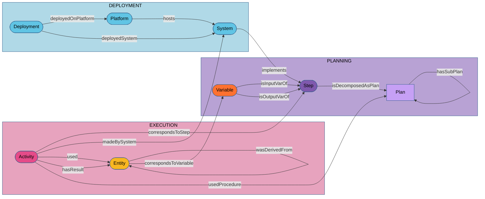

# Nigella Lawson Brownies – p-plan/SSN-SOSA/PROV-O Alignment Demonstration

This example demonstrates a complete implementation of the p-plan/SSN-SOSA/PROV-O alignment framework for process modelling. A brownie recipe (Nigella Lawson's brownies) serves as a running example across three architectural levels: the abstract recipe as a plan, its deployment in a specific kitchen, and one concrete execution with full provenance tracing.

## Conceptual Model

The framework separates concerns across three levels. The diagram below shows the abstract pattern — independent of any specific recipe or kitchen.



The key cross-level relationships are:
- `sosa:System` **implements** `p-plan:Step` (deployment bridges planning and execution)
- `prov:Activity` **correspondsToStep** `p-plan:Step` (execution traces back to the plan)
- `prov:Entity` **correspondsToVariable** `p-plan:Variable` (concrete data traces to abstract variables)

## Complete Example Overview

The diagram below instantiates the pattern for the brownie recipe, showing all plans, steps, variables, systems, activities, and entities in one view.

```mermaid
flowchart RL

%% =====================================================
%% PLANNING
%% =====================================================
    subgraph PLANNING["PLANNING"]
        PLAN0([Plan: Nigella Brownies])

        STEP_smelt([Step: Melting])
        STEP_hak([Step: Chopping])
        STEP_meng([Step: Mixing])
        STEP_bak([Step: Baking])
        STEP_afkoelen([Step: Cooling Down])
        STEP_controle([Step: Quality Check])

        PLAN_SMELT["Melting"]
        PLAN_CHOP["Chopping"]
        PLAN_MIX["Mixing"]
        PLAN_BAK["Baking"]
        PLAN_OBS["Quality Check"]

        V_boter([var:butter])
        V_choc([var:dark-chocolate])
        V_walnoten([var:walnuts])
        V_suiker([var:sugar])
        V_eieren([var:eggs])
        V_bloem([var:flour])
        V_smelt([var:melted-mixture])
        V_hak([var:chopped-walnuts])
        V_beslag([var:batter])
        V_brownies([var:brownies])
        V_kleur([var:colour])

    end

    style PLANNING fill:#b8a2d4,stroke:#2E5C8A,color:#000
    style PLAN0 fill:#7f59ae,stroke:#2E5C8A,color:#000
    style STEP_smelt fill:#7f59ae,stroke:#2E5C8A,color:#000
    style STEP_hak fill:#7f59ae,stroke:#2E5C8A,color:#000
    style STEP_meng fill:#7f59ae,stroke:#2E5C8A,color:#000
    style STEP_bak fill:#7f59ae,stroke:#2E5C8A,color:#000
    style STEP_afkoelen fill:#7f59ae,stroke:#2E5C8A,color:#000
    style STEP_controle fill:#7f59ae,stroke:#2E5C8A,color:#000
    style PLAN_SMELT fill:#c6a0f5,stroke:#2E5C8A,color:#000
    style PLAN_CHOP fill:#c6a0f5,stroke:#2E5C8A,color:#000
    style PLAN_MIX fill:#c6a0f5,stroke:#2E5C8A,color:#000
    style PLAN_BAK fill:#c6a0f5,stroke:#2E5C8A,color:#000
    style PLAN_OBS fill:#c6a0f5,stroke:#2E5C8A,color:#000

    style V_boter fill:#fe7130,stroke:#2E5C8A,color:#000
    style V_choc fill:#fe7130,stroke:#2E5C8A,color:#000
    style V_walnoten fill:#fe7130,stroke:#2E5C8A,color:#000
    style V_suiker fill:#fe7130,stroke:#2E5C8A,color:#000
    style V_eieren fill:#fe7130,stroke:#2E5C8A,color:#000
    style V_bloem fill:#fe7130,stroke:#2E5C8A,color:#000
    style V_smelt fill:#fe7130,stroke:#2E5C8A,color:#000
    style V_hak fill:#fe7130,stroke:#2E5C8A,color:#000
    style V_beslag fill:#fe7130,stroke:#2E5C8A,color:#000
    style V_brownies fill:#fe7130,stroke:#2E5C8A,color:#000
    style V_kleur fill:#fe7130,stroke:#2E5C8A,color:#000

%% Plan structure — top-level steps of plan:nigella-brownies
    PLAN0 -->|hasStep| STEP_smelt
    PLAN0 -->|hasStep| STEP_hak
    PLAN0 -->|hasStep| STEP_meng
    PLAN0 -->|hasStep| STEP_bak

    PLAN0 -->|hasSubPlan| PLAN_SMELT
    PLAN0 -->|hasSubPlan| PLAN_CHOP
    PLAN0 -->|hasSubPlan| PLAN_MIX
    PLAN0 -->|hasSubPlan| PLAN_BAK
    PLAN0 -->|hasSubPlan| PLAN_OBS

    STEP_smelt -->|isDecomposedAsPlan| PLAN_SMELT
    STEP_hak -->|isDecomposedAsPlan| PLAN_CHOP
    STEP_meng -->|isDecomposedAsPlan| PLAN_MIX
    STEP_bak -->|isDecomposedAsPlan| PLAN_BAK
    STEP_controle -->|isDecomposedAsPlan| PLAN_OBS

%% Top-level sequence
    STEP_bak -.->|isPrecededBy| STEP_meng -.->|isPrecededBy| STEP_hak -.->|isPrecededBy| STEP_smelt

%% Steps of plan:baking (sub-level)
    PLAN_BAK -->|hasStep| STEP_controle
    PLAN_BAK -->|hasStep| STEP_afkoelen
    STEP_afkoelen -.->|isPrecededBy| STEP_controle

%% Variables
    V_boter -->|isInputVarOf| STEP_smelt
    V_choc -->|isInputVarOf| STEP_smelt
    V_smelt -->|isOutputVarOf| STEP_smelt

    V_walnoten -->|isInputVarOf| STEP_hak
    V_hak -->|isOutputVarOf| STEP_hak

    V_smelt -->|isInputVarOf| STEP_meng
    V_hak -->|isInputVarOf| STEP_meng
    V_suiker -->|isInputVarOf| STEP_meng
    V_eieren -->|isInputVarOf| STEP_meng
    V_bloem -->|isInputVarOf| STEP_meng
    V_beslag -->|isOutputVarOf| STEP_meng

    V_beslag -->|isInputVarOf| STEP_bak
    V_brownies -->|isOutputVarOf| STEP_bak
    V_kleur -->|isOutputVarOf| STEP_controle
    V_kleur -->|isInputVarOf| STEP_afkoelen
    V_brownies -->|isInputVarOf| STEP_afkoelen
    V_brownies -->|isOutputVarOf| STEP_afkoelen


%% =====================================================
%% DEPLOYMENT
%% =====================================================
    subgraph DEPLOYMENT["DEPLOYMENT"]
        Platform([Platform: Kitchen])
        Deployment([Deployment])

        SYS_smelt([System: Melting System])
        SYS_hak([System: Chopping System])
        SYS_robot([System: Kitchen Robot])
        SYS_oven([System: Oven])
        SYS_Sensor([System: Sensor])
    end

    style DEPLOYMENT fill:#b0d9e7,stroke:#2E5C8A,color:#000
    style Platform fill:#60c4e4,stroke:#2E5C8A,color:#000
    style Deployment fill:#60c4e4,stroke:#2E5C8A,color:#000
    style SYS_smelt fill:#60c4e4,stroke:#2E5C8A,color:#000
    style SYS_hak fill:#60c4e4,stroke:#2E5C8A,color:#000
    style SYS_Sensor fill:#60c4e4,stroke:#2E5C8A,color:#000
    style SYS_robot fill:#60c4e4,stroke:#2E5C8A,color:#000
    style SYS_oven fill:#60c4e4,stroke:#2E5C8A,color:#000

    Deployment -->|deployedOnPlatform| Platform
    Deployment -->|deployedAsset| SYS_smelt
    Deployment -->|deployedAsset| SYS_hak
    Deployment -->|deployedAsset| SYS_robot
    Deployment -->|deployedAsset| SYS_oven
    Deployment -->|deployedAsset| SYS_Sensor

    SYS_smelt -->|implements| PLAN_SMELT
    SYS_hak -->|implements| PLAN_CHOP
    SYS_robot -->|implements| PLAN_MIX
    SYS_oven -->|implements| PLAN_BAK
    SYS_Sensor -->|implements| STEP_controle


%% =====================================================
%% EXECUTION
%% =====================================================
    subgraph EXECUTION["EXECUTION — 10 Feb 2026"]

        Activity_smelt([Activity: Melting])
        Activity_hak([Activity: Chopping])
        Activity_meng([Activity: Mixing])
        Activity_bak([Activity: Baking])
        Activity_obs([Observation: Colour])

        subgraph DERIVATION["DERIVATION — 10 Feb 2026"]
            I_boter([Entity: Butter])
            I_choc([Entity: Chocolate])
            I_wal([Entity: Walnuts])
            I_suiker([Entity: Sugar])
            I_eieren([Entity: Eggs])
            I_bloem([Entity: Flour])
            T_smelt([Entity: Melted Mixture])
            T_hak([Entity: Chopped Walnuts])
            T_beslag([Entity: Batter])
            R_brownies([Entity: Brownies])
            O_kleur([Entity: Light Brown Colour])
        end
    end

    style DERIVATION fill:#f8e1ad,stroke:#2E5C8A,color:#000
    style EXECUTION fill:#e7a3be,stroke:#2E5C8A,color:#000
    style Activity_smelt fill:#e54b89,stroke:#2E5C8A,color:#000
    style Activity_hak fill:#e54b89,stroke:#2E5C8A,color:#000
    style Activity_meng fill:#e54b89,stroke:#2E5C8A,color:#000
    style Activity_bak fill:#e54b89,stroke:#2E5C8A,color:#000
    style Activity_obs fill:#e54b89,stroke:#2E5C8A,color:#000

    style I_boter fill:#f8b622,stroke:#2E5C8A,color:#000
    style I_choc fill:#f8b622,stroke:#2E5C8A,color:#000
    style I_wal fill:#f8b622,stroke:#2E5C8A,color:#000
    style I_suiker fill:#f8b622,stroke:#2E5C8A,color:#000
    style I_eieren fill:#f8b622,stroke:#2E5C8A,color:#000
    style I_bloem fill:#f8b622,stroke:#2E5C8A,color:#000
    style T_smelt fill:#f8b622,stroke:#2E5C8A,color:#000
    style T_hak fill:#f8b622,stroke:#2E5C8A,color:#000
    style T_beslag fill:#f8b622,stroke:#2E5C8A,color:#000
    style R_brownies fill:#f8b622,stroke:#2E5C8A,color:#000
    style O_kleur fill:#f8b622,stroke:#2E5C8A,color:#000

%% Activity relations
    Activity_smelt -->|correspondsToStep| STEP_smelt
    Activity_hak -->|correspondsToStep| STEP_hak
    Activity_meng -->|correspondsToStep| STEP_meng
    Activity_bak -->|correspondsToStep| STEP_bak
    Activity_obs -->|correspondsToStep| STEP_controle

    Activity_smelt -->|madeBySystem| SYS_smelt
    Activity_hak -->|madeBySystem| SYS_hak
    Activity_meng -->|madeBySystem| SYS_robot
    Activity_bak -->|madeBySystem| SYS_oven
    Activity_obs -->|madeBySystem| SYS_Sensor

    Activity_smelt -->|used| I_boter
    Activity_smelt -->|used| I_choc
    Activity_smelt -->|hasResult| T_smelt

    Activity_hak -->|used| I_wal
    Activity_hak -->|hasResult| T_hak

    Activity_meng -->|used| T_smelt
    Activity_meng -->|used| T_hak
    Activity_meng -->|used| I_suiker
    Activity_meng -->|used| I_eieren
    Activity_meng -->|used| I_bloem
    Activity_meng -->|hasResult| T_beslag

    Activity_bak -->|used| T_beslag
    Activity_bak -->|hasResult| R_brownies

    Activity_obs -->|hasResult| O_kleur

%% Derivation
    T_smelt -->|wasDerivedFrom| I_boter
    T_smelt -->|wasDerivedFrom| I_choc
    T_hak -->|wasDerivedFrom| I_wal
    T_beslag -->|wasDerivedFrom| T_smelt
    T_beslag -->|wasDerivedFrom| T_hak
    T_beslag -->|wasDerivedFrom| I_suiker
    T_beslag -->|wasDerivedFrom| I_eieren
    T_beslag -->|wasDerivedFrom| I_bloem
    R_brownies -->|wasDerivedFrom| T_beslag

%% Entity ↔ Variable
    I_boter -->|correspondsToVariable| V_boter
    I_choc -->|correspondsToVariable| V_choc
    I_wal -->|correspondsToVariable| V_walnoten
    I_suiker -->|correspondsToVariable| V_suiker
    I_eieren -->|correspondsToVariable| V_eieren
    I_bloem -->|correspondsToVariable| V_bloem
    T_smelt -->|correspondsToVariable| V_smelt
    T_hak -->|correspondsToVariable| V_hak
    T_beslag -->|correspondsToVariable| V_beslag
    R_brownies -->|correspondsToVariable| V_brownies
    O_kleur -->|correspondsToVariable| V_kleur
```



## Architectural Levels

### 1. Planning Level

The planning level captures the brownie recipe as a reusable, abstract plan — independent of any specific kitchen or occasion.

**Main plan**

`plan:nigella-brownies` is typed as `p-plan:Plan`, `sosa:Procedure`, and `sosa:ActuatingProcedure`. It was created by `agent:nigella-lawson` and sourced from <https://www.nigella.com/recipes/brownies>.

**Sub-plans**

Each major phase of the recipe is elaborated as a named sub-plan (`p-plan:isSubPlanOfPlan plan:nigella-brownies`):

| Sub-plan | Type | Description |
|---|---|---|
| `plan:melting` | `ActuatingProcedure` | Melt butter and chocolate |
| `plan:chopping` | `ActuatingProcedure` | Chop the walnuts |
| `plan:mixing` | `ActuatingProcedure` | Mix all ingredients |
| `plan:baking` | `ActuatingProcedure` | Bake the batter |
| `plan:bake_until_light_brown_top` | `ObservingProcedure` | Monitor colour of the top until light brown |

Note that `plan:bake_until_light_brown_top` is an `sosa:ObservingProcedure` (not actuating), reflecting the quality-check nature of this step.

**Steps and sequence**

Top-level steps of `plan:nigella-brownies` are ordered via `p-plan:isPrecededBy`:

```
step:melting → step:chopping → step:mixing → step:baking
```

Each top-level step is decomposed into its own sub-plan (`p-plan:isDecomposedAsPlan`). The sub-steps within `plan:melting` are:

```
step:butter_and_chocolate_in_pan → step:heat_pan → step:stir_until_homogeneous_liquid_mixture
```

The sub-steps within `plan:baking` are:

```
step:preheating → step:batter_in_baking_tin → step:baking_tin_in_oven
    → step:bake_until_light_brown_top → step:remove_from_oven_and_cool_down
```

`step:bake_until_light_brown_top` is both a `p-plan:Step` and an `sosa:ObservingProcedure`, because it requires a human or sensor to observe the brownie colour, not just actuate.

**Variables**

Variables describe abstract requirements at plan level. Quantities use QUDT (`qudt:quantityValue`, `qudt:numericValue`, `qudt:hasUnit`).

| Variable | `dct:type` | Quantity | Role |
|---|---|---|---|
| `var:butter` | `ingredient:butter` | 375 g | input of `step:melting` |
| `var:dark-chocolate` | `ingredient:dark_chocolate` | 375 g | input of `step:melting` |
| `var:walnuts` | `ingredient:walnuts` | 300 g | input of `step:chopping` |
| `var:sugar` | `ingredient:sugar` | 500 g | input of `step:mixing` |
| `var:eggs` | `ingredient:eggs` | 6 (unitless) | input of `step:mixing` |
| `var:flour` | `ingredient:flour` | 225 g | input of `step:mixing` |
| `var:melted-mixture` | `intermediateproduct:melted-mixture` | — | output of `step:melting`, input of `step:mixing` |
| `var:chopped-walnuts` | `intermediateproduct:chopped-walnuts` | — | output of `step:chopping`, input of `step:mixing` |
| `var:batter` | `intermediateproduct:batter` | — | output of `step:mixing`, input of `step:baking` |
| `var:brownies` | `finalproduct:brownies` | — | output of `step:baking` |
| `var:colour` | _(observation result)_ | — | output of `step:bake_until_light_brown_top`, input of `step:remove_from_oven_and_cool_down` |

Each variable links to both the plan level (`p-plan:isInputVarOf` / `p-plan:isOutputVarOf`) and the procedure level (`sosa:inputFor` / `sosa:outputFor`).

---

### 2. Deployment Level

The deployment level describes how and where the recipe is implemented in a concrete context: Geert Van Haute's kitchen.

**Platform**

`kitchen:kitchen-geert` is typed as `sosa:Platform`. It is attributed to `agent:geert` via a qualified attribution (`prov:qualifiedAttribution attr:relation-kitchen-geert`) with role `role:user`.

**Deployment**

`exec:brownies-baking-for-demo-on-wednesday` is typed as `sosa:Deployment`. It records that a fixed set of kitchen equipment (`sosa:deployedAsset`) has been available in the kitchen since 2010-01-01 (`sosa:startTime`).

**Systems**

Kitchen equipment is modelled as `sosa:System` instances. Composite systems (`sosa:Actuator`) are built from sub-systems via `sosa:hasSubSystem`. Each system implements one or more steps or plans via `sosa:implements`.

| System | Type | Implements | Sub-systems |
|---|---|---|---|
| `inst:melting-system-geert` | `System`, `Actuator` | `plan:melting` | `pan-geert`, `whisk-geert`, `gas-stove-geert` |
| `inst:chopping-system-geert` | `System`, `Actuator` | `plan:chopping` | `cutting-board-geert`, `knife-geert` |
| `inst:kitchen-robot-geert` | `System`, `Actuator` | `plan:mixing` | — |
| `inst:oven-geert` | `System`, `Actuator` | `plan:baking` | — |
| `inst:pan-geert` | `System` | `step:butter_and_chocolate_in_pan` | — |
| `inst:gas-stove-geert` | `System` | `step:heat_pan` | — |
| `inst:whisk-geert` | `System` | `step:stir_until_homogeneous_liquid_mixture` | — |
| `inst:baking-tin-geert` | `System` | `step:batter_in_baking_tin` | — |
| `inst:knife-geert` | `System` | _(cutting component)_ | — |
| `inst:cutting-board-geert` | `System` | _(chopping surface)_ | — |

**Agents**

| Agent | Types | Role |
|---|---|---|
| `agent:nigella-lawson` | `prov:Agent` | Author of the plan (`dct:creator`) |
| `agent:geert` | `prov:Agent`, `sosa:Sensor`, `sosa:System` | Executes the recipe; also acts as the sensor for `step:bake_until_light_brown_top` |

`agent:geert` implements `step:bake_until_light_brown_top` — the quality-check step requires human judgement and is therefore modelled as a `sosa:Sensor` making an `sosa:Observation`.

---

### 3. Execution Level

The execution level records what actually happened on a specific occasion: baking brownies on 10 February 2026.

**Actuation collection**

`exec:brownies-baking-2026-02-10` is typed as `sosa:ActuationCollection`. It spans 20:00–21:30 UTC, uses `plan:nigella-brownies` as its procedure, and has `ent:brownies_001` as its ultimate feature of interest.

**Activities**

The collection has four actuations and one observation (`sosa:hasMember`):

| Activity | Type | `correspondsToStep` | Made by | Result entity | `resultTime` |
|---|---|---|---|---|---|
| `exec:melting-2026-02-10` | `sosa:Actuation` | `step:melting` | `inst:melting-system-geert` | `ent:melted-mixture_001` | 20:30 |
| `exec:chopping-2026-02-10` | `sosa:Actuation` | `step:chopping` | `inst:chopping-system-geert` | `ent:chopped-walnuts_001` | 20:50 |
| `exec:mixing-2026-02-10` | `sosa:Actuation` | `step:mixing` | `inst:kitchen-robot-geert` | `ent:batter_001` | 20:45 |
| `exec:baking-2026-02-10` | `sosa:Actuation` | `step:baking` | `inst:oven-geert` | `ent:brownies_001` | 21:25 |
| `exec:check_when_brownies_are_done` | `sosa:Observation` | `step:bake_until_light_brown_top` | `agent:geert` (sensor) | `ent:colour_001` (light-brown) | 21:30 |

The melting actuation is itself composed of three `prov:Activity` sub-activities, linked via `prov:wasInformedBy`:

| Sub-activity | Associated with | Description |
|---|---|---|
| `exec:acting-as-recipient-2026-02-10` | `inst:pan-geert` | The pan holds the ingredients |
| `exec:heating-2026-02-10` | `inst:gas-stove-geert` | The stove heats the pan |
| `exec:homogenising-2026-02-10` | `inst:whisk-geert` | The whisk homogenises the liquid |

**Entities and derivation chain**

Concrete entities are instantiations of the plan variables (`p-plan:correspondsToVariable`). Provenance is captured via `prov:wasDerivedFrom`:

```
ent:butter_001  ──┐
                  ├──→ ent:melted-mixture_001 ──┐
ent:chocolate_001 ┘                             │
                                                │
ent:walnuts_001 ──→ ent:chopped-walnuts_001 ───┤
                                                │
ent:sugar_001 ─────────────────────────────────┤
ent:eggs_001 ──────────────────────────────────┤──→ ent:batter_001 ──→ ent:brownies_001
ent:flour_001 ─────────────────────────────────┘
```

The observation produces `ent:colour_001` (typed as `colour:light-brown`), whose phenomenon time is recorded as a `time:Instant` (`exec:phenomenon-colour-2026-02-10`).

**Associations and attributions**

`attr:relation-kitchen-geert` is a `prov:Attribution` that qualifies the relationship between `kitchen:kitchen-geert` and `agent:geert` with role `role:user`.

---

## Key Concepts

### Variables and Entities

Variables (`p-plan:Variable`) at plan level describe abstract requirements — what ingredient, how much, and in which step. Entities (`prov:Entity`) at execution level are concrete instantiations of those variables. The predicate `p-plan:correspondsToVariable` links each entity back to its variable, enabling automated traceability from raw data to the original recipe specification.

### Procedures and Systems

A `sosa:Procedure` defines what to do; a `sosa:System` knows how to do it in a particular context. The `sosa:implements` predicate connects them. During execution, `sosa:madeByActuator` (for actuations) and `sosa:madeBySensor` (for observations) record which system carried out the activity. `agent:geert` is modelled as both a `prov:Agent` and a `sosa:Sensor`/`sosa:System` because the quality-check step requires human observation.

### ActuatableProperty vs ObservableProperty

Most transformation steps act on an `sosa:ActuatableProperty` — a property whose value can be changed by an actuator (e.g., `prop:state-butter-chocolate` transitions from solid to liquid). The quality-check step targets an `sosa:ObservableProperty` (`parameter:the_colour_of_the_top_of_the_brownie`) — a property whose value is read, not changed.

### Time and Sequence

Step ordering at plan level uses `p-plan:isPrecededBy`. At execution level, `sosa:startTime` / `sosa:endTime` / `sosa:resultTime` record wall-clock times. For the observation, `sosa:phenomenonTime` points to a `time:Instant`, distinguishing the moment the colour was observed from the moment the result was recorded. Activity dependencies use `prov:wasInformedBy`.

### Sub-activities and prov:wasInformedBy

The melting actuation decomposes into three lower-level `prov:Activity` instances (acting-as-recipient, heating, homogenising), each associated with one physical component. The parent actuation declares `prov:wasInformedBy` each sub-activity, making the internal workflow of the composite system explicit without elevating sub-activities to members of the collection.

---

## Namespaces

| Prefix | Namespace |
|---|---|
| `plan:` | `https://example.org/plan/` |
| `step:` | `https://example.org/step/` |
| `var:` | `https://example.org/variable/` |
| `exec:` | `https://example.org/execution/` |
| `attr:` | `https://example.org/attribution/` |
| `ent:` | `https://example.org/entity/` |
| `inst:` | `https://example.org/installation/` |
| `kitchen:` | `https://example.org/platform/` |
| `agent:` | `https://example.org/agent/` |
| `role:` | `https://example.org/concept/role/` |
| `ingredient:` | `https://example.org/concept/ingredient/` |
| `intermediateproduct:` | `https://example.org/concept/intermediateproduct/` |
| `finalproduct:` | `https://example.org/concept/finalproduct/` |
| `parameter:` | `https://example.org/concept/parameter/` |
| `prop:` | `https://example.org/concept/property/` |
| `colour:` | `https://example.org/concept/colour/` |
| `attribute:` | `https://example.org/concept/attribute/` |
| `p-plan:` | `http://purl.org/net/p-plan#` |
| `sosa:` | `http://www.w3.org/ns/sosa/` |
| `prov:` | `http://www.w3.org/ns/prov#` |
| `time:` | `http://www.w3.org/2006/time#` |
| `dct:` | `http://purl.org/dc/terms/` |
| `qudt:` | `http://qudt.org/schema/qudt/` |
| `unit:` | `http://qudt.org/vocab/unit/` |
| `skos:` | `http://www.w3.org/2004/02/skos/core#` |
| `rdf:` | `http://www.w3.org/1999/02/22-rdf-syntax-ns#` |
| `rdfs:` | `http://www.w3.org/2000/01/rdf-schema#` |
| `xsd:` | `http://www.w3.org/2001/XMLSchema#` |

---

## Conformance

Strictly follows:
- p-plan for process modelling
- SSN-SOSA for sensors and actuators
- PROV-O for provenance
- Separation of abstract planning from concrete execution
